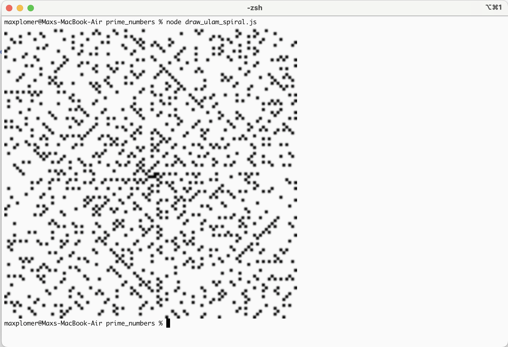

## Initial Setup

First need to install packages used with

### `npm install`

## Generate Primes

Will generate prime numbers

Run with

### `node generate_primes.js`

It will keep endlessly generating prime numbers, function isPrime() is meant to be as simple as possible

## Draw Ulam Spiral

Will display Ulam Spiral in the terminal

https://en.wikipedia.org/wiki/Ulam_spiral

Run in iTerm to display picture in terminal

https://iterm2.com/

Then run with

### `node draw_ulam_spiral.js`

